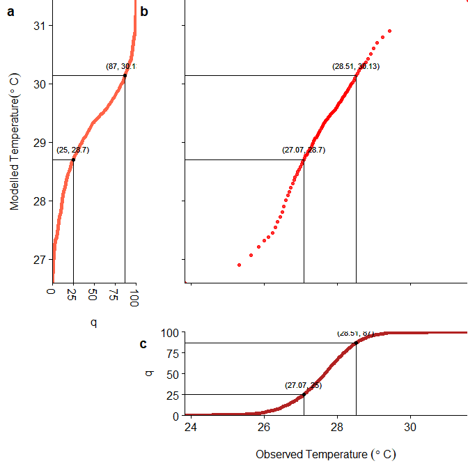

# Bias Correction using qmap
Emilio Gozo  
August 9, 2017  


This evaluates the capability of the R package [*qmap*](https://cran.r-project.org/web/packages/qmap/index.html) to do empirical adjustments to the output of a regional climate model simulation. 

### Load the libraries

```r
library(qmap)
```

```
## Loading required package: fitdistrplus
```

```
## Loading required package: MASS
```

```
## Loading required package: survival
```

```r
library(reshape2)
library(ggplot2) # for plotting
library(cowplot)
```

```
## 
## Attaching package: 'cowplot'
```

```
## The following object is masked from 'package:ggplot2':
## 
##     ggsave
```

### Load test data
The observed data:

```r
obs <- read.csv("input/obs_ts.csv")
```
The output of the model simulation:

```r
mod <- read.csv("input/mod_ts.csv")
```


Table: **Table 1.** Summary of values

           Observed   Modelled
--------  ---------  ---------
Min.       23.82540   26.59500
1st Qu.    27.07358   28.70000
Median     27.65350   29.34700
Mean       27.59976   29.18911
3rd Qu.    28.18658   29.79600
Max.       31.57410   31.43100

We see from Table 1 that the modelled result distribution is different from that of the observed.

### Bias Correction using *QmapQuant*
Non-parametric quantile mapping using empirical quantiles can be done using *fitQmapQUANt* and *doQmapQUANT*. *fitQmapQUANT* estimates the [empirical cumulative distribution function](https://en.wikipedia.org/wiki/Empirical_distribution_function) (ECDF) for both the observed and modelled time series for the specified quantiles. This will then be used by *doQmapQUANT* for bias-correction.

Figure 1 illustrates how the mapping is done. To obtain the bias-corected value:  
1. Compute the quantiles of the modelled data set (*modq*)  
2. Compute the quantiles of the observed data set (*fitq*)  
3. Determine the new value by matching the quantile ranks of *modq* with *fitq* 

As an example, the bias-corrected value of 28.7$^\circ$C is 27.07$^\circ$C because they have the same quantile rank.


```r
fit <- fitQmapQUANT(obs$val, mod$val)
bc_mod <- doQmapQUANT(mod$val, fit)
```



Table 2 confirms that the result after bias correction has the same distribution as the observed data set.


Table: **Table 2.** Summary of values

           Observed   Modelled   BiasCorrected
--------  ---------  ---------  --------------
Min.       23.82540   26.59500        23.82540
1st Qu.    27.07358   28.70000        27.07350
Median     27.65350   29.34700        27.65350
Mean       27.59976   29.18911        27.60388
3rd Qu.    28.18658   29.79600        28.18673
Max.       31.57410   31.43100        31.57410

